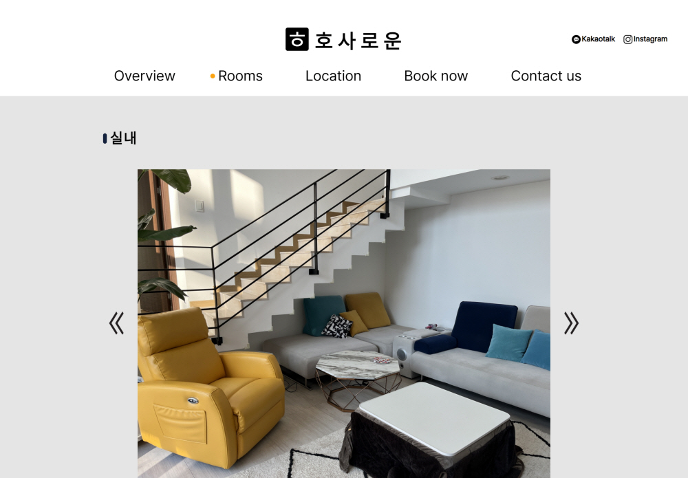
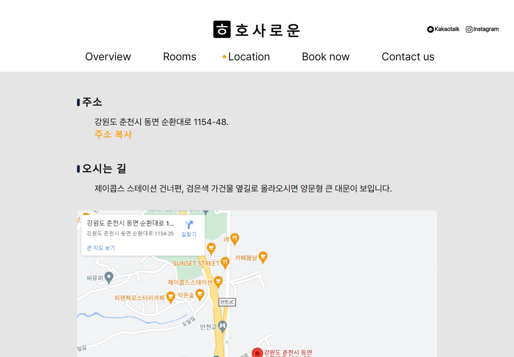
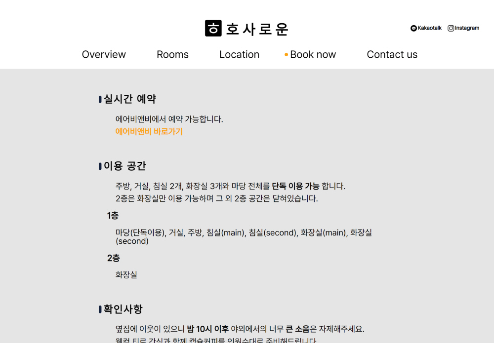

<!-- 목차 -->

**목차**

<ul>
    <li><a href="#개요">개요</a></li>
    <li><a href="#페이지-구성">페이지 구성</a></li>
    <li><a href="#기능">기능</a></li>
    <li><a href="#배포주소">배포주소</a></li>
    <li><a href="#browser-support">Browser Support</a></li>
    <li><a href="#stacks">Stacks</a></li>
    <li><a href="#members">Members</a></li>
</ul>

---

**리액트로 리팩토링 되었습니다.** 
**리액트 리팩토링 Repository를 보고싶다면 [여기를](https://github.com/coldair426/hosaroun-React) 참고하세요.**

---

# 개요

- 프로젝트명 : 호사로운
- 기간 : 2023.01.05. ~ 2023.01.29.
- 목표 : 펜션 호사로운의 효과적인 정보 제공과 모객 효과를 줄 수 있는 페이지
- 동기 : 기존에 펜션 호사로운에 대한 정보가 여러 플랫폼에 흩어져 있었다. 이 정보들을 모으고 안내할 페이지가 필요했다. 또한 공부했던 HTML, CSS, JS 지식을 실제 페이지 제작에서 응용해 보고 싶었다.

# 페이지 구성

|  |  |  |
| :---------------------------------------------: | :------------------------------------------------: | :---------------------------------------------: |
|                   index.html                    |                   overview.html                    |                   rooms.html                    |

|  |  |  |
| :------------------------------------------------: | :-----------------------------------------------: | :-------------------------------------------------: |
|                   location.html                    |                   booknow.html                    |                   contactus.html                    |

# 기능

- <a href="https://velog.io/@coldair426/%EB%B0%98%EC%9D%91%ED%98%95%EC%9B%B9%EA%B5%AC%ED%98%84" target="_blank">Responsive Web(CSS)</a>
- <a href="https://velog.io/@coldair426/stickyheader" target="_blank">Mobile ver. sticky header(CSS)</a>
- <a href="https://velog.io/@coldair426/stickyheader" target="_blank">PC ver. sticky header(JS)</a>
- <a href="https://velog.io/@coldair426/mobilevernavigationmenu" target="_blank">Mobile ver. navigation menu(JS)</a>
- <a href="https://velog.io/@coldair426/%ED%98%84%EC%9E%AC%ED%8E%98%EC%9D%B4%EC%A7%80%ED%91%9C%EC%8B%9C" target="_blank">현재 페이지 표시(JS)</a>
- <a href="https://velog.io/@coldair426/carouselslider" target="_blank">Carousel slider(JS)</a>
- <a href="https://velog.io/@coldair426/imagepreloading" target="_blank">Image preloading(JS)</a>

## 앞으로 구현하고자 하는 것은

- REACT 리펙토링
- 관리자 페이지
- CRUD 게시판

# 배포주소

- ~~http://hosaroun.dothome.co.kr/~~

# Browser Support

- 
- 
- 

# Stacks

## Environment

- 
- 
- 

## Developement

- 
- 
- 

# Members

## 홍

- index, overview, rooms, booknow, contactus
- https://github.com/coldair426
- https://velog.io/@coldair426
- coldair426@gmail.com

## 박

- location
- https://github.com/pannchat
- https://pannchat.tistory.com/

---

**Full README가 보고 싶다면 [velog](https://velog.io/@coldair426/series/%ED%98%B8%EC%82%AC%EB%A1%9C%EC%9A%B4%ED%94%84%EB%A1%9C%EC%A0%9D%ED%8A%B8)를 참고하세요.**
