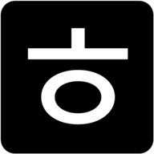
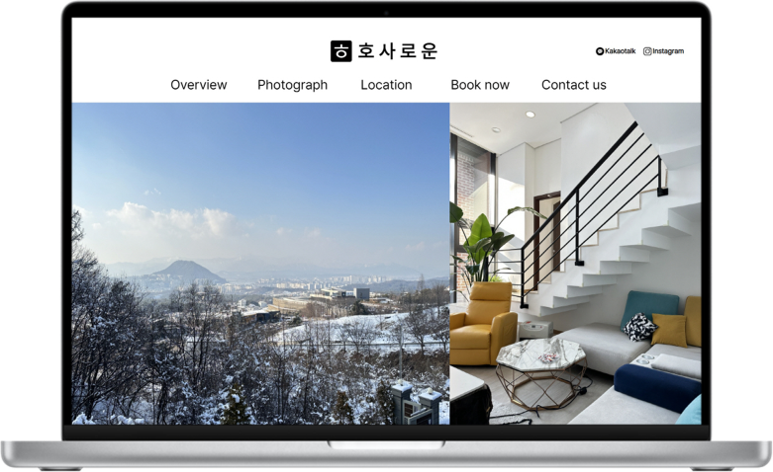
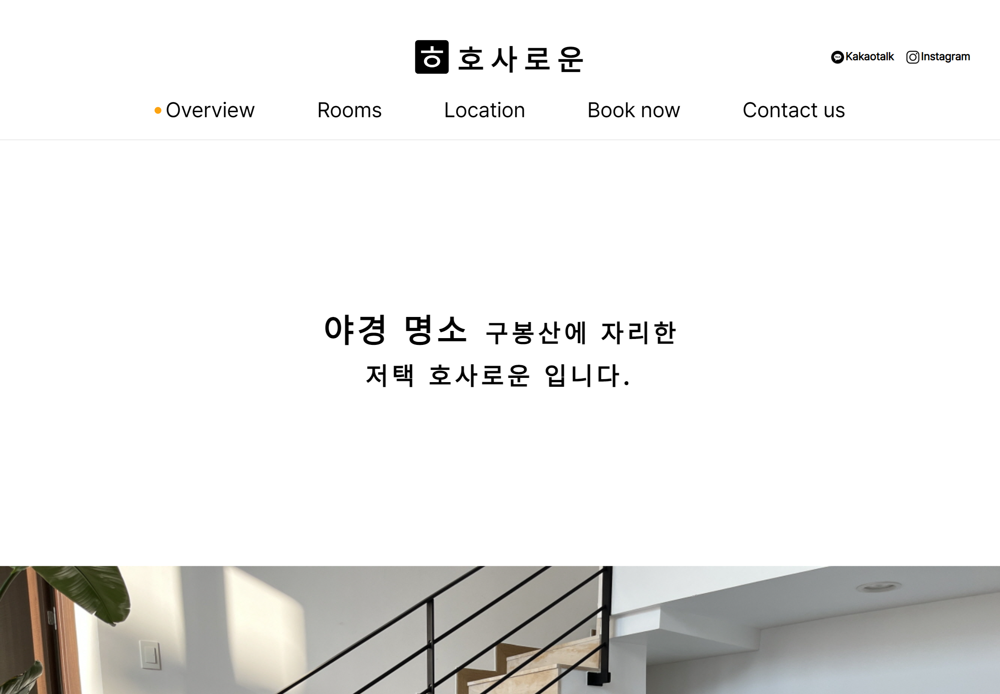
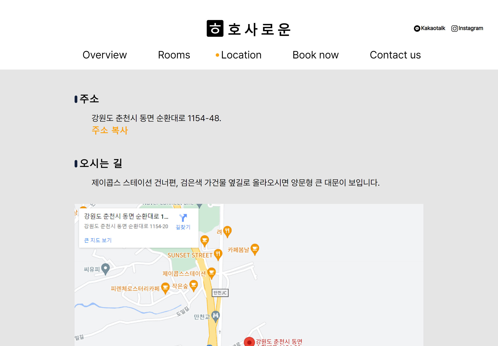
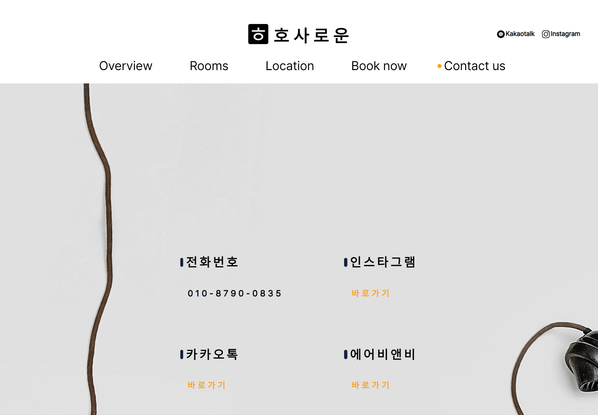

<!-- 목차 -->

**목차**

<ul>
    <li><a href="#개요">개요</a></li>
    <li><a href="#구성">구성</a></li>
    <li><a href="#기능">기능</a></li>
    <li><a href="#배포주소">배포주소</a></li>
    <li><a href="#browser-support">Browser Support</a></li>
    <li><a href="#stacks">Stacks</a></li>
    <li><a href="#members">Members</a></li>
</ul>

---

 
 
 

# 개요

- 프로젝트명 : 호사로운
- 기간 : 2023.01.05. ~ 2023.01.30.
- 목표 : 펜션 호사로운의 효과적인 정보 제공과 모객 효과를 줄 수 있는 페이지
- 동기 : 기존에 펜션 호사로운에 대한 정보가 여러 플랫폼에 흩어져 있었다. 이 정보들을 모으고 안내할 페이지가 필요했다. 또한 공부했던 HTML, CSS, JS 지식을 실제 페이지 제작에서 응용해 보고 싶었다.

 

# 페이지 구성

|  |  |  |
| :---------------------------------------------: | :------------------------------------------------: | :---------------------------------------------: |
|                   index.html                    |                   overview.html                    |                   rooms.html                    |

 

|  |  |  |
| :------------------------------------------------: | :-----------------------------------------------: | :-------------------------------------------------: |
|                   location.html                    |                   booknow.html                    |                   contactus.html                    |

 

# 기능

1. 여러분의 애플리케이션이 무엇을 하는지,
   왜 그 기술을 사용했는지,
1. 여러분이 당면했던 문제나
1. 나중에 추가하고 싶은 기능이 무엇인지

 

# 배포주소

- http://siksunbi.dothome.co.kr/

 

# Browser Support

 

# Stacks

## Environment

## Developement

 

# Members

## 홍

- index, overview, rooms, booknow, contactus
- https://github.com/coldair426
- https://velog.io/@coldair426
- coldair426@gmail.com

## 박

- location
- https://github.com/pannchat
- https://pannchat.tistory.com/

 
 
 

---

Full README가 보고 싶다면 [velog](https://velog.io/@coldair426/series/%ED%98%B8%EC%82%AC%EB%A1%9C%EC%9A%B4%ED%94%84%EB%A1%9C%EC%A0%9D%ED%8A%B8)를 참고하세요.
